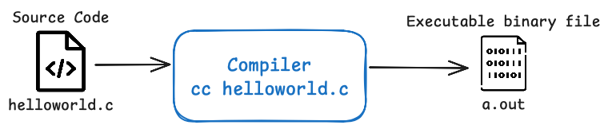
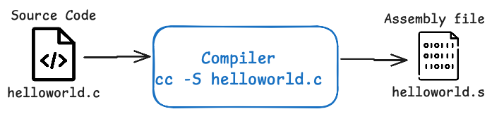

▶️ [YT Link - Lesson 1](https://www.youtube.com/watch?v=HjXBXBgfKyk)

- [Learn C: Lesson 1](#learn-c-lesson-1)
	- [Disclaimer](#disclaimer)
	- [What is C and its evolution](#what-is-c-and-its-evolution)
	- [Hello World Sk3pper!](#hello-world-sk3pper)
	- [C Compiler](#c-compiler)
	- [Assembler and Assembly Code](#assembler-and-assembly-code)
		- [Puts VS Printf](#puts-vs-printf)
	- [Break Down Hello World](#break-down-hello-world)
		- [1. Preprocessor](#1-preprocessor)
# Learn C: Lesson 1

## Disclaimer
> Disclaimer: The C course will be presented in an **instinctive**, **unprepared style**, similar to other channel videos, aiming for freshness and spontaneity. This course is **suitable** for those **with prior programming experience in languages** like JavaScript, Ruby, or Python, who also have a basic understanding of how computers work at a low level.
> The course will prioritize *clarity* and *practicality*, using small programs to illustrate C concepts.

## What is C and its evolution
C is a very old language, which has evolved *relatively little* over the years, but not that little either. Let's say it has evolved **little** from the point of view of **syntax**, **constructs**, and the **basic C library**, but it has undergone a **great evolution in terms of the compiler**, the assumptions that can be made about the underlying machine, and so on. 

Anyway, it *remains a relatively simple language to learn*, in the sense that it is composed of few ideas, and remains a **relatively difficult language to apply**, in the sense that these ideas **must first be fully absorbed and then actually put into practice**. And it will be necessary to train our minds gradually. We should arrive in the scenario where given a problem, an image of how it can be solved using the *C language* is created within us. The good news is that once this ability is created, there is a non-trivial transfer of this ability to other programming languages and, conversely, those with experience in other programming languages will be able to make good use of their acquired prior experience. 

## Hello World Sk3pper!
C is a compiled language. Let's write the classic "Hello World" program to understand what happens. Five lines of code:
```c
// helloword.c

#include <stdio.h>

int main(void){
    printf("Hello World Sk3pper!\n");
    return 0;
}
```

The purpose of this program is to write *"Hello World Sk3pper!"* to the terminal, but the program **cannot be executed directly**. I currently have a file in my directory called `helloworld.c`. If I try to execute this file, it obviously won't be possible to execute it, because it's a file that I first need to **compile**. 

## C Compiler
To compile it, we need to use the **C compiler**, which is usually a program written in C. There are different C compilers. There was a very famous one in history, from Intel, the **Intel C Compiler**, but the one that provided a powerful, free C compiler to the masses was **GCC**. The original author is [Richard Stallman](https://en.wikipedia.org/wiki/Richard_Stallman), whom many will know for his huge impact on free software; he was essentially the single person who had the greatest influence on free software in history. So, let's thank Stallman!.

```bash
cc helloworld.c
```



Using the C compiler in its simplest form, typing `cc` (or `gcc`), which is the name of the compiler executable, with the name of the text file that contains the C program. After the command execution the program is compiled and, showing the content of the directory, there's a new file called `a.out` which is an **executable**. This executable is a **binary file**, so now the C language has been transformed into machine language and, it can be executed. Obviously, in addition to machine language, this file also contains **headers** that are specific to executables of different platforms: on Windows it will say one thing, on Linux it will say another. 

Using `hexdump` to see the content of the file there are also strings put by the compiler. It remains a fairly small program. The executable part is minimal.

```bash
hexdump -C a.out

00000000  cf fa ed fe 07 00 00 01  03 00 00 00 02 00 00 00  |................|
00000010  10 00 00 00 10 04 00 00  85 00 20 00 00 00 00 00  |.......... .....|
00000020  19 00 00 00 48 00 00 00  5f 5f 50 41 47 45 5a 45  |....H...__PAGEZE|
00000030  52 4f 00 00 00 00 00 00  00 00 00 00 00 00 00 00  |RO..............|
....
00002060  00 01 5f 00 12 00 00 00  00 02 00 00 00 03 00 f0  |.._.............|
00002070  08 00 00 02 5f 6d 68 5f  65 78 65 63 75 74 65 5f  |...._mh_execute_|
00002080  68 65 61 64 65 72 00 09  6d 61 69 6e 00 0d 00 00  |header..main....|
00002090  f0 08 00 00 00 00 00 00  02 00 00 00 0f 01 10 00  |................|
000020a0  00 00 00 00 01 00 00 00  16 00 00 00 0f 01 00 00  |................|
000020b0  70 04 00 00 01 00 00 00  1c 00 00 00 01 00 00 01  |p...............|
000020c0  00 00 00 00 00 00 00 00  02 00 00 00 02 00 00 00  |................|
000020d0  20 00 5f 5f 6d 68 5f 65  78 65 63 75 74 65 5f 68  | .__mh_execute_h|
000020e0  65 61 64 65 72 00 5f 6d  61 69 6e 00 5f 70 72 69  |eader._main._pri|
000020f0  6e 74 66 00 00 00 00 00                           |ntf.....|
```

## Assembler and Assembly Code
It's also possible to use, with certain C compilers, the `-S` option to see the **assembly code** that is generated starting from the C source code program. This code is then processed by an **assembler** to turn it into machine code. 



```bash
cc -S helloworld.c
```
Here, the translation of C into assembly:

```assembly
helloworld.s

	.section	__TEXT,__text,regular,pure_instructions
	.build_version macos, 15, 0	sdk_version 15, 5
	.globl	_main                           ## -- Begin function main
	.p2align	4, 0x90
_main:                                  ## @main
	.cfi_startproc
## %bb.0:
	pushq	%rbp
	.cfi_def_cfa_offset 16
	.cfi_offset %rbp, -16
	movq	%rsp, %rbp
	.cfi_def_cfa_register %rbp
	subq	$16, %rsp
	movl	$0, -4(%rbp)
	leaq	L_.str(%rip), %rdi
	movb	$0, %al
here! -->	callq	_printf <-- here!
	xorl	%eax, %eax
	addq	$16, %rsp
	popq	%rbp
	retq
	.cfi_endproc
                                        ## -- End function
	.section	__TEXT,__cstring,cstring_literals
L_.str:                                 ## @.str
	.asciz	"Hello World Sk3pper!\n"

.subsections_via_symbols
```

> If we are interested in writing C, why do we dwell on something so peculiar as the generation of assembly through, intermediate compilation?

Because we want to show the C compiler can be invoked in different ways and, depending on how we call it, it will generate different levels of assembly with different **levels of optimization**, **different performance**, and the difference is truly abysmal between one type of optimization that we can enable and another type. 

In the first output of assembly code, the `printf` function is called, and in fact in the `helloworld.c` program the `printf` function is called. Using compile optimization level 2 (`-O2`) the compiler is instructed to notice things that can be written much better than it is written, and it will translate the program into a more efficient program, which will have **the exact same semantics**, the exact same behavior as the original program. 

Let's see, nothing changes in a program like this: *"Hello World Sk3pper!"* was written before, *"Hello World Sk3pper!"* is written now, nothing has changed. 
```bash
❯ cc helloworld.c
❯ ./a.out
Hello World Sk3pper!

❯ cc -O2 helloworld.c
❯ ./a.out
Hello World Sk3pper!
```

> What is the difference with `O2` and without the optimization?

```bash
cc -02 -S helloworld.c
```

Using `-S` to create the assembly program with the level 2 optimization (`-O2`), this time the `printf` function is no longer called, but the `puts` function is called, which also serves to write things to the terminal. The difference is that the `puts` function is **actually faster**. 

```assembly
helloworld-O2.s

	.section	__TEXT,__text,regular,pure_instructions
	.build_version macos, 15, 0	sdk_version 15, 5
	.globl	_main                           ## -- Begin function main
	.p2align	4, 0x90
_main:                                  ## @main
	.cfi_startproc
## %bb.0:
	pushq	%rbp
	.cfi_def_cfa_offset 16
	.cfi_offset %rbp, -16
	movq	%rsp, %rbp
	.cfi_def_cfa_register %rbp
	leaq	L_str(%rip), %rdi
here! -->	callq	_puts <-- here!
	xorl	%eax, %eax
	popq	%rbp
	retq
	.cfi_endproc
                                        ## -- End function
	.section	__TEXT,__cstring,cstring_literals
L_str:                                  ## @str
	.asciz	"Hello World Sk3pper!"

.subsections_via_symbols
```

### Puts VS Printf
Seeing, with the manual page, the `puts` function:

```bash
❯ man puts

...
SYNOPSIS
    #include <stdio.h>
    ...
    int puts(const char *s);

DESCRIPTION
    ...
    The function puts() writes the string s, and a terminating newline character, to the stream stdout.
...
```

The function is very simple: it takes a string as input (we'll see what that is) and prints it to the screen. 

Comparing with the the `printf` manual:
```bash
❯ man 3 printf

... long doc ...
SYNOPSIS
     #include <stdio.h>
     int printf(const char * restrict format, ...);
     ...
... long doc ...
```
*\** Use `man 3 printf` because there are two different `printfs`: the shell command (section 1, shown by default) and the C library function (section 3). 

`puts` is much simpler, there's smaller documentation, and the manual tells us: *" The function puts() writes the string, and a terminating newline character, to the stream stdout."*. The `printf` function, in the end, doesn't add the newline itself, `puts` does add it. 

Come back to the `helloworld.c` source code the new line is added in the end of the line.
```c
printf("Hello World Sk3pper!\n");
```

But, if we dig into the assembly code we will see two different scenarios:
```assembly
[cc -S helloword.c] .asciz	"Hello World Sk3pper!\n"

[cc -O2 -S helloword.c].asciz	"Hello World Sk3pper!"
```

The compiler removed it because it wanted to use `puts` instead of `printf`, and so it removed the newline from the end of the string. This is a drop in the ocean, what the compiler can do in terms of optimizations, you have no idea what it can do.  But already, even in this simple example, you can see the sophistication of the optimizations that a mature C compiler can perform even modifying the input based on the fact that the function changes. It knows that here is a different semantic between `printf` and `puts` so it changes the input. This is very interesting.

## Break Down Hello World
Let's now break down this small program to **understand what each line does**. 

### 1. Preprocessor
```c
#include <stdio.h>
```

C preprocessor directives begin with a `#` symbol. 
> What is a directive?

In practice, **before** compiling the program, the compiler calls another program, which is often simply part of the compiler itself (but you can imagine it as a distinct program, and sometimes it is a distinct program), which **processes** the `#` directives. These directives **as like were not an integral part of C**, of the real language, but if were a part that, precisely, "**preprocessor**," that happens before; from the word itself it's understood that it's a **phase preceding compilation**. And the preprocessor performs what look like more or less **text transformations**, that is, these transformations occur in the source itself of the C program. 

`include` means to include, a file, that is, to take this file and transform it into a file that is the sum of this inclusion here. So imagine unpacking into this file that I wrote, `helloworld.c`, the content of the `stdio.h` file, which is a library file placed somewhere. 

> What's in this library file?

All the headers of all the functions that C program needs, because otherwise how does the C program know what `printf` is? You should know that `printf` is indeed a function that is part of the **C standard library**, but it's **not part of the language itself**. The language itself only has a few keywords, like `return`, `int`, `void`, `while`, `if`, etc. But `printf` **is a function that is defined in the C-library, but it's not part of C-itself (it's not part of the language itself)**. 

> Who does tells it that we effectively have a function that we can use, that takes certain parameters?

The  `.h` file tells it, which is called a header file. In fact, `.h` is short for header. C files, we'll usually see them called either `.c`, and they contain the program itself, or `.h`, and they always contain C source, but which is not the actual execution logic of the program, but which is information, let's say, necessary but peripheral. The difference is this: that usually **I might want to include a header file in different `.c` fileS through, precisely, the preprocessor**. 

It is possible also include a `.c` file in a `.c` file. For example: It is possible to have a `printf.c` file:
```c
printf("Hello World Sk3pper!\n");
```

And a `helloworld-included.c` file which instead of writing `printf`, I write `include file.c`. and it works perfectly.
```c
// helloworld-included.c

#include <stdio.h>

int main(void){
    #include "printf.c"
    return 0;
}
```
If we compile this program, everything works exactly as before. Nothing has changed, because what happens is that the preprocessor, before compiling, takes the content of the `.c` file and unpacks it into my `main` function, right in place of the `include`. Whatever the content of `file.c` is, it performs this substitution, a bit like a "*find and replace*" in a text editor. 

> What's inside `stdio.h`?

**Let's eliminate the first line `#include <stdio.h>`**, the preprocessor directive. When we go to compile, the program fails with an error.

```bash
❯ gcc helloworld.c
helloworld.c:4:5: error: call to undeclared library function 'printf' with type 'int (const char *, ...)'; ISO C99 and later do not support implicit function declarations [-Wimplicit-function-declaration]
    4 |     printf("Hello World Sk3pper!\n");
      |     ^
helloworld.c:4:5: note: include the header <stdio.h> or explicitly provide a declaration for 'printf'
1 error generated.
```

It tells us: at line 4, at character position 5 there's an error because a library function, `printf`, was called, and the standard doesn't support calling library functions without (in theory, it should simply say "unknown function") but since this is an advanced compiler, it knows that I made a mistake because I should have declared it, but it also tells me: *"Look, I might know how `printf` is defined, it's an integer with `const char*` and so on, but since I am a C99 compiler, you cannot call me implicitly."*

If we go and look at the definition of the `printf` function and copying and write it instead of the `#include <stdio.h>` line we will have:
```c
// no_stdio_hello.c

int printf(const char * restrict format, ...);

int main(void){
    #include "printf.c"
    return 0;
}
```

The `printf` function unlike `main` (which is also a function, but it contains the body of the function - the code that implements it) after defining the function name, it immediately ends with a semicolon. This is called the **prototype of a function**. 

> What is it for?

It serves to define only the **return type** and the **arguments the function takes**, in this way another program can calls `printf` even if it doesn't know how `printf` is defined internally and how it works. The only information the caller needs is **what type it returns** and **what arguments it takes**.

So, instead of including `stdio.h`, simply include this *prototype*, the compiler already knows enough about how it should call the `printf` function and therefore it can generate the assembly and then the machine code to make the program work. If now we compile the C program, it also works without the specific include.

**And the others parts? We will see in the following lessons!**