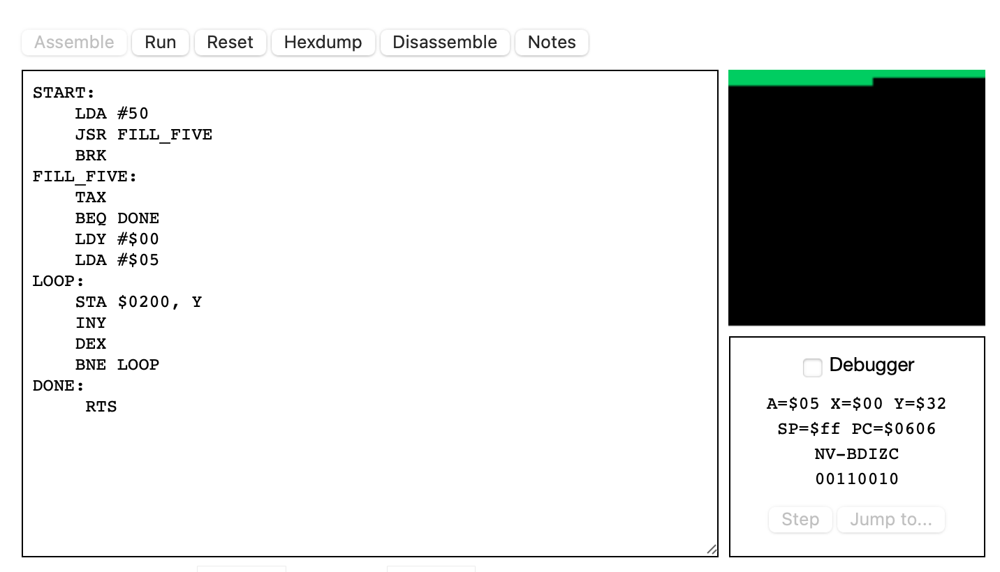
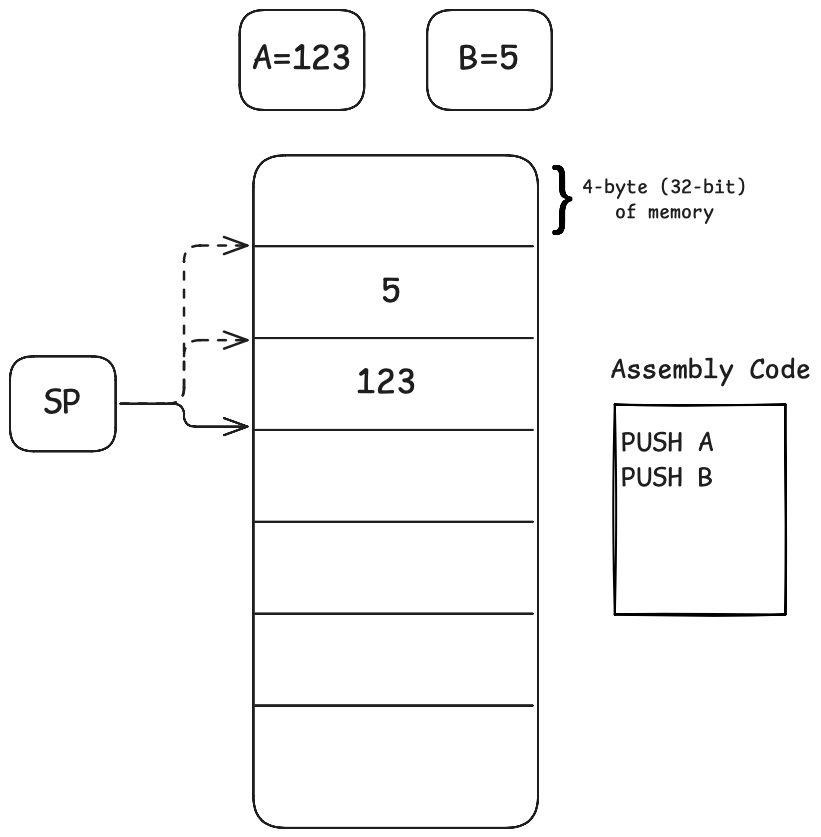
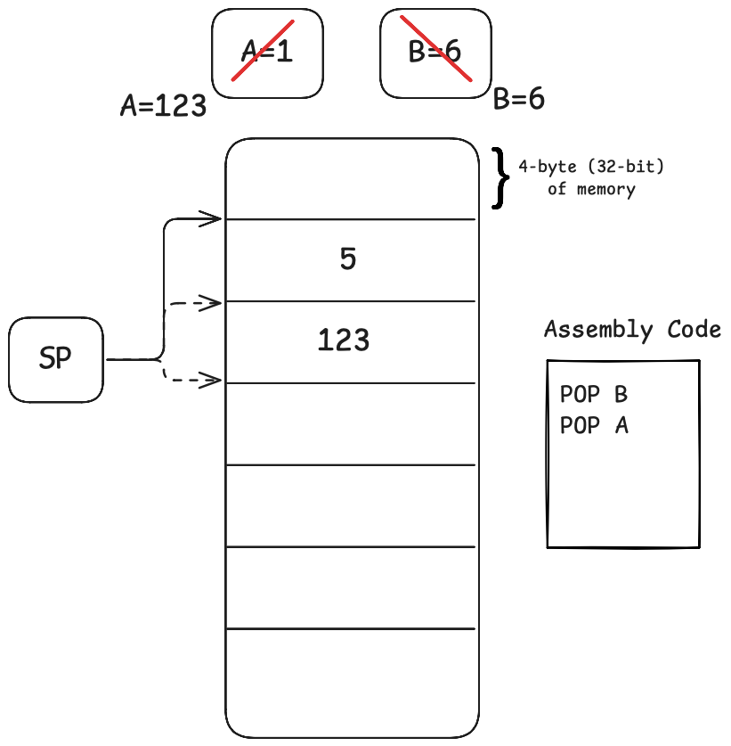
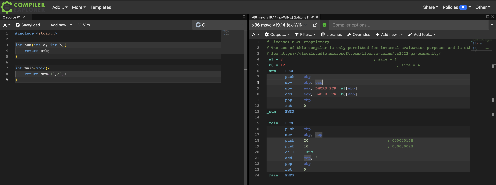
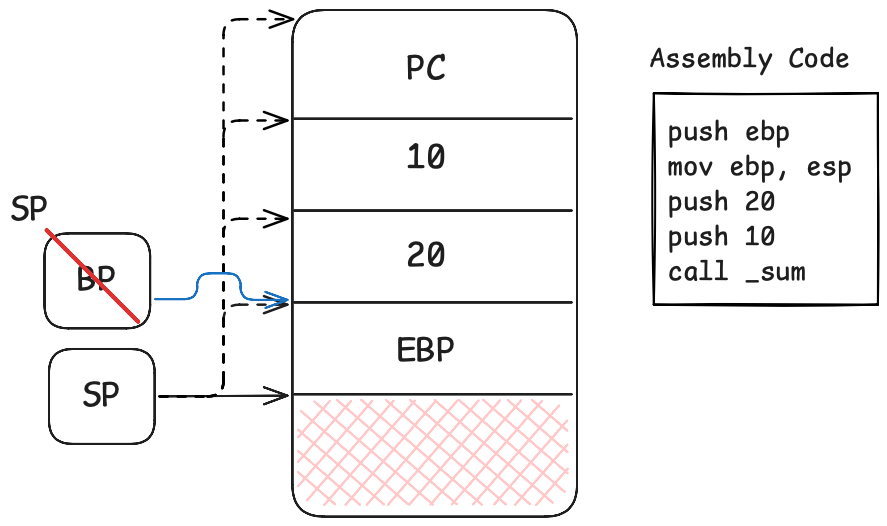
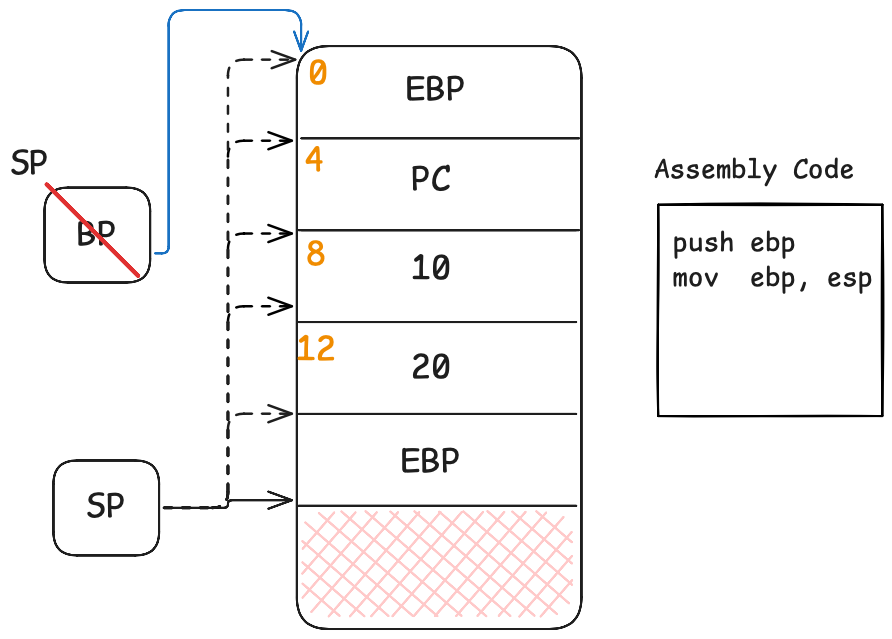
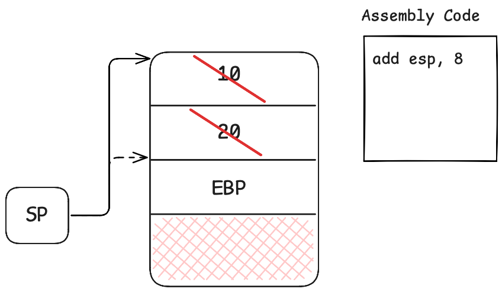

▶️ [YT Link - Lesson 2 - Appendix](https://www.youtube.com/watch?v=r6mU_IHXEps)
- [Learn C: Appendix to Lesson 2: The Life of Local Variables](#learn-c-appendix-to-lesson-2-the-life-of-local-variables)
  - [Introduction: The Ephemeral Nature of Local Variables in C](#introduction-the-ephemeral-nature-of-local-variables-in-c)
  - [The 6502 Microprocessor: A Simple Model](#the-6502-microprocessor-a-simple-model)
  - [Function Calls and Register Management in Assembly](#function-calls-and-register-management-in-assembly)
    - [The x86 Architecture and the Stack](#the-x86-architecture-and-the-stack)
  - [How C Functions Use the Stack: A Practical Example](#how-c-functions-use-the-stack-a-practical-example)
  - [Conclusion: Understanding Local Variables and Tools for Exploration](#conclusion-understanding-local-variables-and-tools-for-exploration)

# Learn C: Appendix to Lesson 2: The Life of Local Variables
## Introduction: The Ephemeral Nature of Local Variables in C

When we discussed in the second lesson that function parameters are local variables, we also mentioned that you can define other local variables. We said that **local variables** are **created during a function call and destroyed when the function returns**.

This idea of variables being *created* and *destroyed* makes a lot of sense when talking about high-level languages. This isn't to say it doesn't make sense in C, but the idea is easier to visualize with a language like, for example, JavaScript. In JavaScript, we would imagine that when a function returns, **any objects assigned to its local variables lose their references**. If an object's reference count drops to zero—meaning it's no longer referenced by any global or local variables—*the Garbage Collector will delete it because it's no longer reachable*.

> However, C primarily manipulates numbers, at least from what we've seen so far. What does it mean for a local variable in C to be "**created**" and "**destroyed**"?

To understand this, you need to know a bit about how a **microprocessor works**. In fact, we're going to do something a bit crazy today and see what happens on two different microprocessors.

## The 6502 Microprocessor: A Simple Model

The 6502 is the microprocessor from the Commodore64, a processor that's over 40 years old. Its extreme simplicity makes it particularly useful for understanding **what's happening under the hood**. Here the link of [6502 microprocessor emulator](https://skilldrick.github.io/easy6502/).

The program I'm showing you wasn't compiled from C; I wrote it directly in assembly this afternoon.

```assembly
START:
    LDA #50
    JSR FILL_FIVE
    BRK
FILL_FIVE:
    TAX
    BEQ DONE
    LDY #$00
    LDA #$05
LOOP:
    STA $0200, Y
    INY
    DEX 
    BNE LOOP
DONE:
     RTS
```

All microprocessors, from the 6502 to the M3 in the recent MacBook, have **two primary ways of operating on data**.
1. First, they have a set of **registers**. Registers are small, extremely fast variables located right inside the processor's core. They can only hold numbers—either integers or, in modern processors, floating-point numbers as well. Instructions can refer directly to these registers, which are typically named with letters (like A, B, C, D) or a letter followed by a number, depending on the processor's design.
2. Second, besides operating on registers, processors can use instructions to move data from a **RAM location to a register**, or from a register back to RAM. Operations generally happen inside the registers, but they are often loaded from and saved to memory. Some more advanced CISC processors can even use complex instructions to move data directly from one RAM memory location to another without using registers as an intermediate step.

The 6502 has very few registers. It has the `A` register, called the **accumulator**. For example, the instruction `LDA #50` means "load the value 50 into the A register." After loading this value, which acts as the parameter for a function like `F(50)`, it jumps to a subroutine, in this case, `JSR fill`. This `fill` function will use the value in the `A` register to write a byte of color 5 to the video memory 50 times (A-times).

> On this simulator, the screen is memory-mapped. If you write to memory locations starting from hexadecimal `0x0200`, each byte corresponds to a pixel's color. Writing the value 5 in successive memory locations fills the screen with green pixels. As you can see when I execute the code, it prints 50 green pixels.



Let's see how it works. 

2. `LDA #50`: The **parameter** — the number of pixels to write to the video memory — is passed using the `A` register.
6. `TAX`: The first thing the `fill` function does is `TAX`, which means **Transfer A to X**. It copies the value from the `A` register to the `X` register. The `X` register is another one of the 6502's registers.
7. `BEQ DONE`: The code then checks if the value is zero; if so, jump to the DONE address/label. In our case, it's 50, so this check is ignored. The BEQ instructions means: jump to given address/label if zero flag is set.
89. `LDY #$00`/`LDA #$05`: it loads the value `0` into the `Y` register and the value `5` into the `A` register.

>Wait, the `A` register now holds `5`, destroying the `50` we needed for our loop count! This is okay because we already saved the count to the `X` register with the `TAX` instruction. As you can see, registers are easily **overwritten because they are, in a sense, "local" to their immediate use**. You must be careful to save any register values you'll need **later**.

10. `LOOP`: The main loop is interesting. The `Y` register is used as an index.
11. `STA $0200, Y`: 
    -  STA means **ST**ore **Accomulator**, that is store the A value to the given memory location. In this case the memory location it is given to the `0x0200` plus the value in `Y`. 
    - `$0200`: This is the base memory address. On the 6502 simulator being used, the video memory begins at this hexadecimal address. The first pixel of the screen corresponds to memory location `$0200`, the second to $0201, and so on.
    - The first time through the loop, `Y` is 0, so it writes a green pixel (`5`) to `vidmem[0]`.
12. `INY`: It **increments `Y`** (`INY`) to point to the next pixel location.
13. `DEX`: It **decrements `X`** (`DEX`), which holds our loop counter.
14. `BNE LOOP`: If `X` is **not yet zero** (`BNE`), it jumps back to the start of the LOOP. Otherwise, the function returns.

> How does this relate to local variables?

In this program, I used the `A` register as the function's argument. If this function were to call another function, that new function would likely overwrite the `A` register for its own purposes. This is how the values of local variables can be "lost" in C. Because C often uses registers for computations, the value held in a register is **ephemeral** — once the register is repurposed, the original variable effectively no longer exists.

## Function Calls and Register Management in Assembly

An assembly **function** often calls other **functions** that need to use the **same registers**. To handle this, you must save the registers before the call and restore them afterward. This is typically done using the **stack**.

Other architectures, like the 32-bit x86 (or 386), are ideal for understanding how **C compilation works** and how **local variables are managed**. This architecture primarily uses the *stack* for its **function calling convention**. A calling convention is a standard that C compilers on a given architecture must follow to ensure functions *pass* and *receive* arguments consistently. This means a function compiled with one compiler can be used by a program compiled with a different one, as long as both adhere to the architecture's standard.

When I showed you in the first C lesson that you could just use a function prototype and it would work, it's because the compiler uses the prototype to understand how to call that function according to the convention. It just needs the function's address. This allows you **to link code compiled by different tools at runtime**, and it will all work together seamlessly.

### The x86 Architecture and the Stack
The x86 Architecture has a simply and and clear function calling convention (all this discussion to deeply understand what are local variables in C).

We need to understand what is the **Stack**: the stack is simply a region of computer RAM memory (like other piece of the memory but it is called stack). For the 32-bit x86 architecture, you can imagine it as being divided into 4-byte (32-bit) slots. A special register called the **Stack Pointer** (`SP`) always points to the **"top"** of the stack.

There are two key instructions:
  * `push`: Takes a value (e.g., from a register) and puts it on top of the stack. It does this by first **decrementing** the `SP` and then writing the value to that new memory location. So, if `SP` points to an address and we `push A`, the `SP` is decremented by 4, and the value of `A` is stored there. If we then `push B`, the `SP` is decremented again, and `B` is stored at the new top of the stack

<p align="center"></p>

  * `pop`: Takes the value from the top of the stack and loads it into a destination (e.g., a register). It then **increments** the `SP`. A subsequent `pop B` would retrieve that value and increment `SP`, effectively removing it and storing in the register B (the same happens for `pop A` instruction).
  
<p align="center"></p>

## How C Functions Use the Stack: A Practical Example

Let's return to the lesson-2 C-program example and it is possible to use the online [Compiler Explore](https://godbolt.org) tool, with the `x86 msvc v19.14` compiler, and compiled the program.

<p align="center"></p>

Here's a simplified look at the assembly generated for `main`:

16.  `push ebp`: `main` starts by saving the current **Base Pointer** (`ebp`) register onto the stack. This saves the stack frame of the function that called `main`.
17.  `mov ebp, esp`: It then copies the current stack pointer (`esp`) into `ebp`. This establishes a new, stable base pointer for `main`'s stack frame. This `ebp` will serve as **a fixed reference point to access arguments and local variables**.
18.  `push 20`: The second argument (20) is pushed onto the stack.
19.  `push 10`: The first argument (10) is pushed onto the stack.
20.  `call sum`: This instruction does two things:
     1. it pushes the **return address** (the address of the instruction *after* the `call`) onto the stack (the PC - Program Counter - value). With the `ret` instruction (the last instruction inside the call function) this value is resumed to continue with the next `call` instruction (in this case the line 21).
     2. it jumps to the `sum` function's code.

<p align="center"></p>

Now we are inside the `sum` function. It begins with a similar prologue:

7.  `push ebp`: It saves the *caller's* `ebp` (which is `main`'s `ebp`) onto the stack.
8.  `mov ebp, esp`: It establishes its own base pointer for its own stack frame.

<p align="center"></p>

At this point, the stack contains the return address (PC), the old `ebp`, and the function arguments (10 and 20). Relative to the new `ebp` (blue line), the function's arguments can be found at fixed positive offsets: the first argument (`a`) is at `ebp+8`, and the second argument (`b`) is at `ebp+12`.

The `sum` function then performs its logic:

9. `mov eax, DWORD PTR _a$[ebp]` == `mov eax, [ebp+8]`: It moves the first argument (`a`) into the `eax` register.
10. `add  eax, DWORD PTR _b$[ebp]` == `add eax, [ebp+12]`: It adds the second argument (`b`) to the `eax` register. The result of the sum is now in `eax`, which **by convention is used for function return values.**

Finally, the function returns:

11. `pop ebp`: This restores the caller's (`main`'s) base pointer from the stack.
12. `ret`: This pops the return address from the stack into the Program Counter, resuming execution back in `main`.

18. `add esp, 8`: After `sum` returns, `main` cleans up the stack by adding 8 to the stack pointer (`add esp, 8`), removing the reference to the two arguments that were pushed before the call. If the program were to call another function after `sum`, those same memory locations on the stack would be **overwritten** by the arguments and local variables of the new function call.

<p align="center"></p>

## Conclusion: Understanding Local Variables and Tools for Exploration 

So, this is what local variables are in C: they are either values in **temporary registers** or **temporary locations on the stack**. When a function returns, the registers are immediately reused, and the stack space **is considered free to be overwritten by the next function call**. This is what it means for them to be "destroyed."

I know this was a long explanation, but it's crucial to understand what's happening "under the hood." If you want to explore this further, I highly recommend two tools:
  * **Easy 6502**: A wonderful site to experiment with 6502 assembly.
  * **Compiler Explorer**: An awesome tool (godbolt.org) that lets you write C code and instantly see the assembly it generates for various architectures.

You can achieve something similar with `gcc -S` on your own machine, but that will only show the assembly **for your specific architecture (of your computer)**. In contrast, the 386 assembly is of the clearest for learning. It's much easier to read compared to modern assembly like AMD64.
